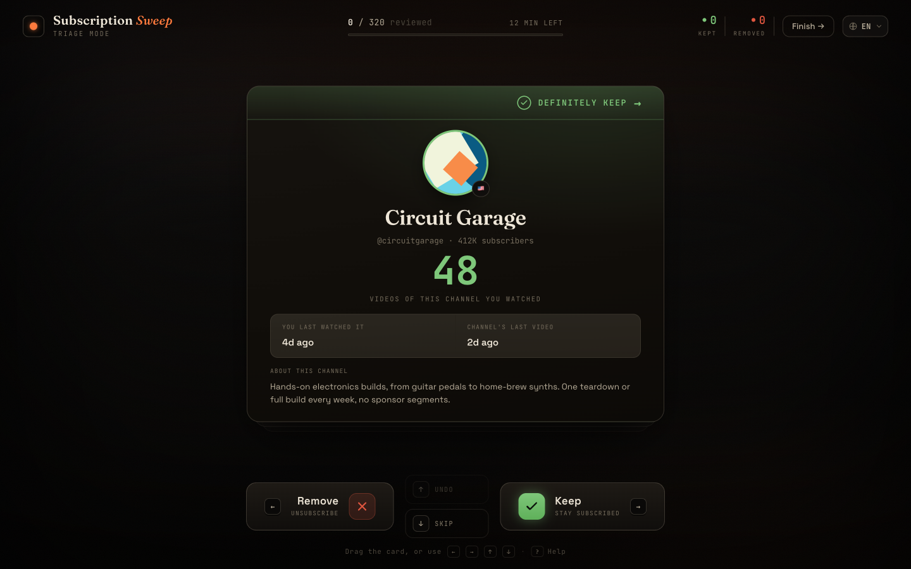
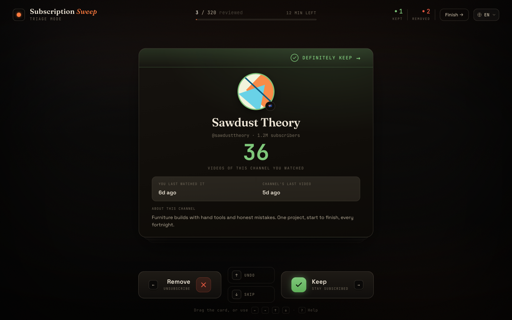
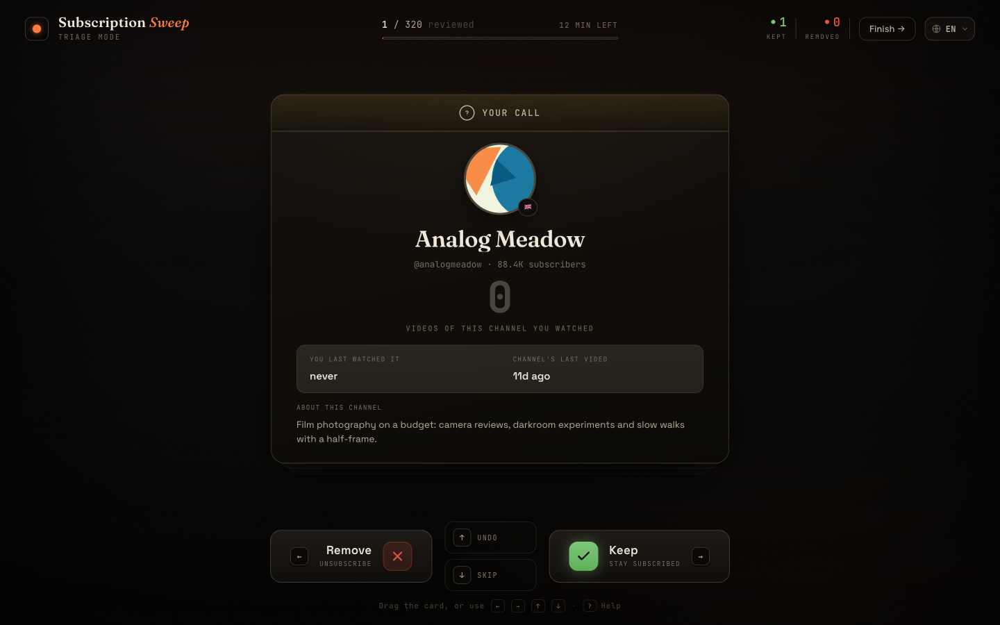
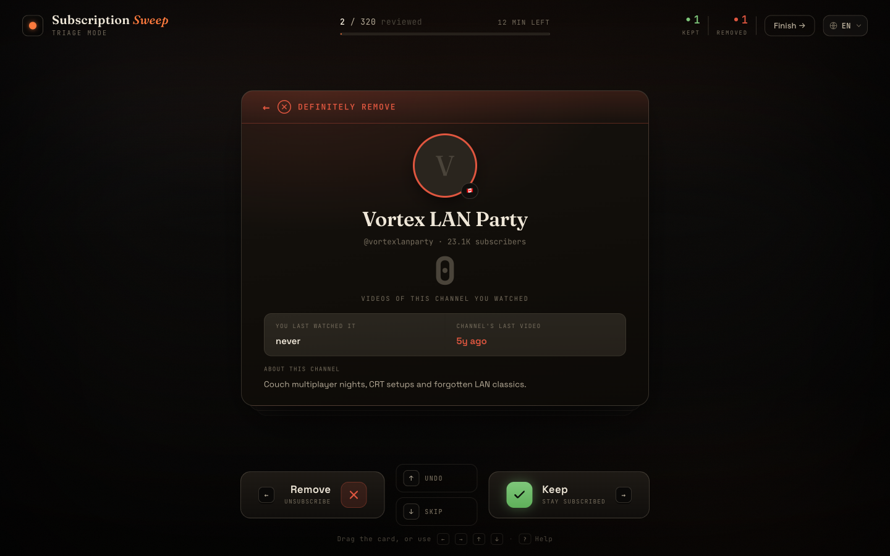

<div align="center">

# 🧹 Subscription Sweep

### Bulk-unsubscribe and clean up years of YouTube subscriptions in minutes — ranked by how much *you* actually watch.

Swipe to keep or remove, one channel at a time. **No API key. No account. Local-first** — run it on your own machine and your data never leaves it.



</div>

---

Most cleanup tools sort your subscriptions by the channel's activity ("last upload"). **Subscription Sweep sorts by _your_ behaviour** — how many of a channel's videos you've actually watched, and how recently. That's the signal you really decide on, and it's the one nobody else surfaces.

It reads your **Google Takeout** watch history *locally*, scores each channel's keep-likelihood, and pre-colours every card so you know which way to swipe before you read a thing:

<div align="center">



</div>

> 🟢 **Definitely keep** — you watch it a lot, recently &nbsp;·&nbsp; 🟡 **Your call** — still active, but you never watched it (a forgotten favourite?) &nbsp;·&nbsp; 🔴 **Definitely remove** — dead and never watched.

## Use it

- **▶ Run it locally (recommended — fully private).** Three commands, Python 3.9+ is the only requirement. Your data never leaves your machine. ⬇️
- **▶ Use it online** — *(coming soon)* the same open-source app, hosted, with nothing to install. Your file is processed only for your session and deleted within 24 hours; for full privacy, run it locally.

```bash
git clone https://github.com/MrCryptoHat/youtube-subscription-cleaner.git
cd youtube-subscription-cleaner
./start.sh
```

`start.sh` sets up a virtual environment, installs the dependencies, starts a local server and opens
your browser. The in-app wizard walks you through the rest.

## How it works

```
   Google Takeout  ─►  keyless enrichment  ─►  swipe to decide  ─►  export  ─►  unsubscribe
   (subs + history)    (avatars, sizes,        (keep / remove,      decisions    (4 ways —
                        last upload — no API)    pre-scored)         + restore     pick yours)
```

1. **Import your Takeout.** Drag your YouTube [Google Takeout](https://takeout.google.com/) `.zip`
   onto the page. It finds your subscriptions and watch history inside — in any export language.
   Nothing is uploaded (local mode); the file is parsed on the spot.
2. **Keyless enrichment.** For each channel the app fetches the avatar, last-upload date and size
   straight from YouTube's public pages and RSS feeds — **no Google Cloud project, no API key, no OAuth.**
3. **Swipe.** Each card is pre-scored and colour-coded by a keep-likelihood formula (your watch
   volume × recency, minus channel neglect). Dead and deleted channels are auto-sorted so you focus on
   the ones that need a human. ← removes, → keeps, ↓ skips. Drag, click, or use the keyboard.
4. **Review & export.** Check the final list across four tabs (removing / keeping / undecided / gone),
   sort and search, fix anything, then export.
5. **Unsubscribe for real** — four ways, below.

> **Heads up on Takeout:** Google takes anywhere from a few minutes to a few hours to build your export
> and emails you when it's ready. The in-app wizard shows exactly which boxes to tick (subscriptions +
> history, history as JSON for accurate dates).

## Export — four ways out

YouTube has **no native bulk-unsubscribe** — you normally click each channel by hand. Subscription
Sweep gives you the list and several ways to act on it; pick whatever you trust:

- **`unsubscribe.html` — a standalone page with a saved progress tracker.** Open channels one by one,
  tick them off; it remembers your progress, works offline, and never breaks on a YouTube redesign.
- **`unsubscribe-brief.md` — a brief for your AI agent.** Hand it to Claude Code (or any agent): it
  contains safety rules, a browser-automation path *and* a YouTube-API path with quota math, so the
  agent can unsubscribe for you and adapt to whatever YouTube's UI looks like today.
- **`unsubscribe.json` — a flat machine-readable list** (`channel_id`, `handle`, `url`) to script against.
- **`decisions.json` — a full backup of your review.** Re-import it any time to **restore the whole
  session** — your zones and keep/remove/pending decisions come back exactly as you left them, even on
  another machine.

Or run the built-in **paced browser automation** (local mode):

```bash
./unsubscribe.sh
```

It opens Chromium, you **sign in to YouTube once**, and it clicks through the removals from your
exported list at a human pace (so it won't trip YouTube's rate limits). Safe to stop (`Ctrl-C`) and
re-run — it skips what's already done and never touches a channel it isn't certain you're subscribed to.

## Why not a Chrome extension?

| | Bulk-unsubscribe extensions | Console scripts | OAuth tools | **Subscription Sweep** |
|---|---|---|---|---|
| Sorts by **how much you watch** | ❌ (channel activity only) | ❌ | ❌ | ✅ |
| No account / no broad permissions | ❌ (runs in your session) | ✅ | ❌ (OAuth) | ✅ |
| No API key / Google Cloud setup | ✅ | ✅ | ❌ | ✅ |
| Free, no bulk-action paywall | ⚠️ (some) | ✅ | ✅ | ✅ |
| Undo + review-before-removing | ❌ | ❌ | ⚠️ | ✅ |
| Open source, runs locally | ⚠️ | ✅ | ❌ | ✅ |

Bulk-unsubscribe extensions are *engagement-blind* — they sort by the channel's upload activity, never
by what you actually watch. Some paywall bulk actions; all of them operate inside your signed-in
browser session. Google separately
[warns](https://support.google.com/youtube/answer/7404651) about third-party extensions that subscribe
you to channels without consent — a good reason to prefer an open-source tool you run once and can read.
Subscription Sweep needs no extension and no sign-in, and ranks by *your* watch history.

## Privacy

- **Local mode is fully local.** The server runs on `127.0.0.1`. Your Takeout, decisions and YouTube
  session never leave your computer.
- **No API key, no OAuth, no account linking.** Enrichment uses the same public pages your browser loads.
- **No analytics, no trackers, no telemetry.** Ever.
- The only network requests are fetching public YouTube channel pages/feeds during enrichment, and —
  only if you run `./unsubscribe.sh` — your own browser session acting on youtube.com.
- A **hosted** instance (if you run one, or use a public one) holds as little as possible: only derived
  channel data and your decisions, in an isolated per-session folder auto-deleted within 24h. Raw watch
  history is never written to disk. See [`/privacy`](static/privacy.html) and [`deploy/`](deploy/).

## Self-hosting

Want to offer this to others (or just run it on your own server)? It ships a **hosted multi-user mode**:
per-session isolation, TTL cleanup, upload limits and a shared enrichment cache, all behind one env flag.
A Caddy + systemd runbook is in **[`deploy/DEPLOY.md`](deploy/DEPLOY.md)**.

```bash
SWEEP_MODE=hosted SWEEP_ALLOWED_HOSTS=sweep.example.com \
  python -m uvicorn server.app:app --port 8765
```

## FAQ

**Is there a bulk unsubscribe for YouTube?**
Not natively — YouTube makes you unsubscribe one channel at a time. Subscription Sweep gives you a fast
swipe interface plus several ways to do the un-subscribing (a paced browser step, a standalone tracker
page, an AI-agent brief, or a JSON list).

**How do I mass-unsubscribe from YouTube channels?**
Import your Takeout, let it score everything, accept the "remove" suggestions in the review screen, then
use any of the four export paths above. The dead/unwatched channels are pre-marked for you.

**Does this need a Google API key or OAuth?**
No. That's the point. It reads your Takeout export and scrapes only public channel pages. Nothing to set
up in Google Cloud Console.

**How is it different from a Chrome extension?**
It ranks channels by *your own watch history* (no extension does this), it's open source and runs
locally with no account access, it's free, and it has undo + a review step. See the table above.

**Will it get my account rate-limited?**
The browser-automation step acts slowly, at a human pace, only on channels you chose — specifically to
avoid the 24–48h cooldowns that fast scripts trigger. The other export paths don't touch your account at all.

**My watch history looks incomplete.**
Google Takeout only retains a limited window of watch history. The app shows that window and treats
"never watched but still active" channels as *forgotten favourites* ("your call"), never auto-removing them.

## Tips

- **English and Russian** — the UI auto-detects your browser language and you can switch any time
  (top-right corner). Adding a language is one entry in `static/i18n.js`.
- **Choose JSON for your watch history** in Takeout (the wizard shows you where) — it gives accurate
  "last watched" dates. HTML works too.
- **It's resumable.** Close the tab any time; your progress is saved. And your exported `decisions.json`
  re-imports as a full session restore — even on another machine.

## Project layout

```
server/            FastAPI backend
  app.py             routes: import, enrich, channels, state, export
  ingest.py          language-agnostic Takeout parser (zip / csv / json / html)
  enrich.py          keyless enrichment (RSS + public channel pages) + shared cache
  zones.py           keep-likelihood score + verdict bands
  exports.py         the unsubscribe.json / agent-brief / standalone-html builders
  store.py           per-user state (local singleton or per-session, for hosted mode)
  cache.py           shared cross-user channel-info cache (SQLite)
  config.py          env-driven settings (SWEEP_MODE = local | hosted)
static/            the single-page app (index.html · app.js · style.css · i18n.js)
scripts/
  unsubscribe.py     Playwright unsubscribe (language-agnostic, paced)
deploy/            Caddyfile + systemd unit + runbook for the hosted mode
tests/             pytest suite (ingest, zones, exports, API round-trips)
start.sh           set up + run the app
unsubscribe.sh     run the optional browser-automation unsubscribe step
```

## Contributing

Built with FastAPI + a vanilla single-page app + Playwright. PRs welcome — run the tests with
`pip install -r requirements.txt pytest httpx && pytest`. Found a security issue? See
[SECURITY.md](SECURITY.md).

If this saved you some clicks, a ⭐ helps others find it.

## License

[MIT](LICENSE).
